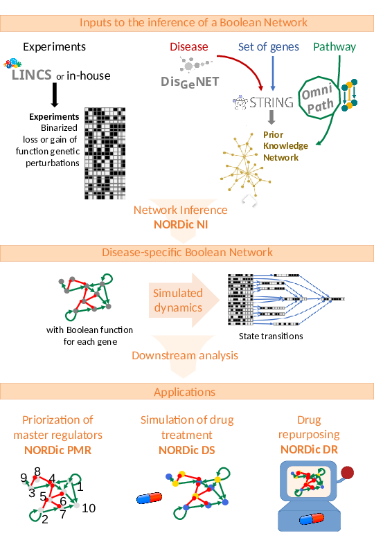

# Introduction

Genes, proteins and messenger RNAs are shown to interact on each other in order to modulate gene activity. Conversely, gene activity impacts
protein production, and consequently triggers the chemical reactions needed for survival in healthy individuals. As such, perturbations
of these gene regulatory interactions, through (epi)genetic and/or environmental factors, might cause diseases: e.g., the suppression of the 
activity of gene SCN1A is linked to a specific type of epilepsy called Dravet syndrome, both in mice and humans [@Kalume2013]. Gene 
regulatory networks, which are graphs connecting biological entities according to their known regulatory interactions, are useful models 
that enable a better understanding of those regulatory mechanisms [@Karlebach2008]. 

In particular, one type of gene regulatory networks, called Boolean networks, allows the definition of so-called regulatory functions 
[@Thomas1973; @Kauffman1969]. Those functions are specific to each node in the graph, and determine the activity of this node 
according to its regulators. Those functions are defined on the Boolean domain (**True** or **False**), meaning that we only consider binary 
gene activities. Subsequently, studying this type of networks as a dynamical system (and determining their basins of attraction, for instance) 
remains rather tractable [@Moon2022]. The potential applications are numerous. Taking into account network dynamics should improve tools originally developed using non Boolean networks, such as the Transcription Factor Influence score in CoRegNet [@Nicolle2015] for the identification of interesting 
biomarkers, or drug repurposing. For the latter, a library of druggable molecules can be screened for good candidates based on the paradigm of "signature reversion"; a good drug candidate should be able to "reverse" the gene activity profile 
associated with a diseased individual [@Duan2016; @Delahaye2016; @Musa2018]. That is, such a drug would stimulate abnormally weakly activated genes with 
respect to healthy individuals, and vice-versa.
This screening approach may considerably speed up drug development, especially for rare or tropical neglected diseases [@Walker2021].

However, the construction and analysis of Boolean networks become extremely tedious and time-consuming in the absence of experimental data or 
when considering the activity of a large number of genes at a time [@Collombet2017]. 

Moreover, the identification of interesting drug targets, via the detection of master regulators --genes at the top of the regulatory hierarchy-- suffers 
from, first, not exploiting the full network topology, and thus, being oblivious to transcriptional regulatory cascades, which might account 
for toxic unexpected side effects [@Bolouri2003; @Huang2019]. Second, those detection methods might not take into account the gene activity information relative to diseased 
patients. 

Finally, regulatory mechanisms at (post-)transcriptomic level are inherently stochastic [@Raj2008]. As a consequence, naive algorithms for Boolean network-based *in silico* drug repurposing rely on testing a given drug a large number of times, in order to get a good estimate of its effect on gene activity. Such methods might resort to the simulation of drug treatment on Boolean network in either a patient-specific approach [@Montagud2022], or by ignoring the stochastic part of gene regulation. In both cases, this might incur a potential loss of robustness in the recommendations. Indeed, those approaches do not provide clear guarantees on the probability of error in recommendation, and might not be sample-efficient. In addition, they do not take advantage of supplementary information on drugs which might help to test drugs more efficiently (e.g., leveraging similarities between drugs in terms of effects on gene activity to infer 
their effect on gene activity).

# Statement of need

As a general rule, the development of **NORDic** relies on avoiding *ad hoc* solutions, by implementation of approaches which are relevant to all kinds of 
diseases regardless of the level of knowledge present in the literature --contrary to approaches which rely on knowing the relation between membrane receptors 
and a set of genes which activity characterizes the presence of the disease, for instance "Causal Reasoning Analytical Framework for Target discovery" 
(CRAFT) [@Srivastava2018]. Please refer to Figure 1 for an overview of the package. Solutions proposed in this package emphasize on, first, the modularity of the methods, by providing functions which can tackle different 
types of regulatory dynamics for instance; second, on the transparency of the approaches, by allowing the finetuning of each method through parameters with a clearly 
defined impact on the result.

## Automated identification of disease-related Boolean networks

Most prior works about building Boolean networks assume the existence of either a Prior Knowledge Network (PKN) --that is, a preselected set of known regulatory 
interactions among genes of interest-- and/or a set of perturbation experiments, where the gene activity of a subset of genes is measured after a single gene 
perturbation. Those works then propose approaches to infer in an automated way a Boolean network based on these data (e.g., PROFILE [@Beal2021], or BoolNet 
[@Mussel2010]), by studying gene activity correlations (ARACNE [@Margolin2006], *parmigene* [@Sales2011]), or through answer-set programming, having converted 
experimental measures into a set of Boolean constraints (BoneSiS [@Chevalier2019], Re:IN [@Yordanov2016]). However, for rare diseases for instance, pinpointing a 
subset of genes of interest is already a difficult task by itself.

One approach, called CasQ [@Aghamiri2020], has specifically proposed a direct, automated conversion from regulatory maps in the MINERVA database [@Gawron2016] to 
Boolean networks. However, not only does this method need the definition of prior regulatory maps, but 
it also relies on automatically assigning gene regulatory functions based on the regulators of each 
gene according to the map. This automated procedure asserts that a given gene is considered active if and only if every one of its reported activatory regulators is active, 
and all of its inhibitory regulators are inactive. However, since this choice does not take into account dynamical information from experiments, resulting regulatory functions 
might impact the quality of gene activity predictions.

Moreover, there exist two hurdles to building Boolean networks which are specific to the Boolean framework. First, gene activity data must be binarized, meaning that 
one has to decide when a given gene is considered active or inactive in each sample. Such a process leads to an unavoidable loss of information. In order to avoid bias in the inference process, this step should be 
data-driven and user-controlled. For instance, when using PROFILE [@Beal2021], a majority of genes might end up with an undetermined status --meaning that they are considered 
neither significantly strongly nor weakly active-- which considerably undermines the input from experimental constraints. 

Second, the problem of identification of a Boolean 
network is usually underdetermined, as there is too few of experiments and measurements in practice, compared to the size of the considered gene set.

Module **NORDic Network Identification (NI)** addresses these issues in an automated and user-controllable manner, by performing information extraction from large online 
sources of biological data, and data quality filtering according to user-selected parameters, which control every step of the process. As such, the hope is that **NORDic** 
makes the generation of disease-specific Boolean networks easier, reproducible, even in the absence of previously curated experiments, prior knowledge networks, or even a set of disease-associated genes. The 
pipeline implemented in **NORDic** was applied to epilepsy in a preliminary work [@Reda22022].

## Prioritization of master regulators in Boolean networks

The identification of master regulators might relate to the disease onset or affected biological pathways of interest. Some methods targeted at their detection emphasize on the 
centrality of the location of the gene in the network, e.g., by computing a centrality-associated value for each gene in the network, and recommending top genes. For instance, one might compute the outgoing degrees using built-in application Network Analysis in Cytoscape [@Shannon2003], or the Control Centrality value [@Liu2012] using the CytoCtrlAnalyser [@Wu2018] application. Yet those functions only leverage 
topological information about the network, and do not take into account gene activity data related to the disease. That is, the gene activity context does not impact the genewise values computed on the network.

A notable exception is the work by @Zerrouk2020, which considers gene activity data from patients afflicted with rheumatoid arthritis, and compute a gene activity-based influence score using tool CoRegNet [@Nicolle2015]. However, that computation does not take into account downstream transcriptional cascades [@Bolouri2003], that 
is, regulatory effects which trickle down the network, beyond the targets directly regulated by the gene. 

Module **NORDic PMR** detects master regulators in a Boolean network, given examples of gene activity profiles from patients. In contrast to prior works, the score assigned to 
(groups of) master regulators takes into account the network topology as well as its dynamics with respect to the diseased profiles. The approach, based on a machine learning 
algorithm solving the influence maximization problem [@Kempe2003], is described in @Reda22022.

## Novel approaches for scoring drug effects & repurposing drugs

**NORDic** also proposes to tackle two problems related to drug repurposing: first, drug scoring, based on its ability to reverse the diseased gene activity profile 
(**NORDic DS**); second, the computation of an online sampling procedure which determines which drugs to test during drug screening for repurposing, in order to guarantee a bound on the error in recommendation, while 
remaining as sample-efficient as possible (**NORDic DR**).

There exist other approaches performing signature reversion, as mentioned in introduction. However, module **NORDic DS** (since version 2.0 of **NORDic**) is the first package to 
implement drug scoring based on Boolean networks, which can apply to any disease --for instance, it does not need the definition of specific biological phenotypes that should 
be observed after exposure to treatment [@Montagud2022]. The method implemented in **NORDic DS** is described in @Reda2022.

Similarly, module **NORDic DR** is the first approach that aims at solving the lack of guarantees in recommendation error. **NORDic DR** relies on bandit algorithms, which are sequential 
reinforcement learning algorithms that enable the recommendation of most efficient drugs. Based on Boolean network simulations performed on the fly, those algorithms can adaptively select the next drug to test in order to perform recommendations with as few samples 
as possible. Algorithms implemented in **NORDic DR** are described and theoretically analyzed in @Reda22021 (for the *m-LinGapE* algorithm), and in @Reda2021 (*MisLid* algorithm).

## Extraction of information from large public data sets & simulation module

In all four present modules in **NORDic**, helper functions in module **NORDic UTILS** are implemented in order to extract and curate data in a transparent way from the LINCS 
L1000 [@Subramanian2017], OmniPath [@Turei2016], DisGeNet [@Pinero2016] and STRING [@Szklarczyk2021] databases. **NORDic** also proposes a simulation module, which allows to test 
the accuracy of the predictions made by the network compared to known measurements. This module also enables the study and the visualization of the behaviour of the network under various perturbations and types of regulatory dynamics.

# Summary

Building a representation of gene interactions and their influences on gene activity, in an automated and reproducible way, helps to model more complex diseases and 
biological phenomena on a larger set of genes. These models might speed up the understanding of the gene regulation hierarchy by bioinformaticians and biologists; and allow to 
predict novel drugs or gene targets which might be investigated later for healthcare purposes. In particular, the network-oriented approach might be able to predict off-targets. The
**NORDic** Python package aims at tackling those problems, with a focus on reproducibility and modularity. It primarily relies on popular formats for network description files, such 
as the .bnet format. Moreover, **NORDic** enables further study of the network in Cytoscape, by providing a direct conversion to .sif formats, along with a dedicated style file. The different pipelines present in **NORDic** produce intermediary files, which might be checked by the user, and can be fed again to the pipeline in order to reproduce the results.

To get started with the different modules proposed in **NORDic**, please check out the tutorials (Jupyter notebooks) on the GitHub repository [@Reda2023], which provides an application to a 
disease called Congenital Central Hypoventilation Syndrome (CCHS).

# Acknowledgements

This work was supported by Université Paris Cité, Université Sorbonne Paris Nord, the French National
Research Agency (#ANR-18-CE17-0009-01) (A.D.-D., C.R.), (#ANR-18-CE37-0002-03) (A.D.-D.), (#ANR-21-RHUS-009) (A.D.-D., C.R.). The 
implementation of the bandit algorithm *MisLid* in **NORDic DR** was achieved with the help of Andrea Tirinzoni and of Rémy Degenne at Inria, 
UMR 9198-CRIStAL, F-59000 Lille, France.

# References